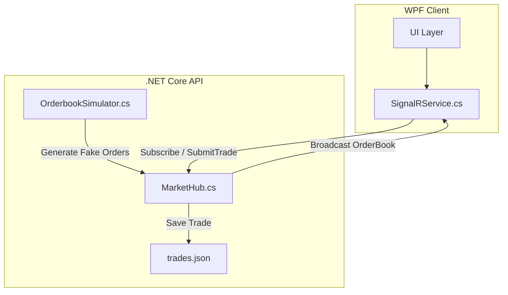

# RealTimeTrading

## Overview

This project is a simplified real-time trading platform developed. It simulates a live order book and allows users to execute buy/sell trades through a WPF client interface connected via SignalR.

## Architecture


## Features

- Order book simulation with randomized bid/ask data
- Real-time updates via SignalR groups
- Buy/Sell confirmation dialogs
- Trade execution and local history persistence
- Trade history viewer in UI
- Unit tests for core logic (order book generation, trade persistence)

## Technology Stack

- .NET 9 (preview)
- ASP.NET Core SignalR
- WPF (Windows Presentation Foundation)
- xUnit & Moq for testing
- System.Text.Json for serialization

## Project Structure

- `TradingBackend`: SignalR hub, order book simulator, data models
- `TradingFrontend`: WPF UI, trade interaction logic
- `TradingBackend.Tests`: Unit tests for backend logic

## Running the App

1. Start the backend:

   ```bash
   cd TradingBackend
   dotnet build
   dotnet run
2. Start the FrontEnd

   ```bash
    cd TradingFrontend
   dotnet build
   dotnet run
3. Run Unit test 
   dotnet test TradingBackend.Tests
   or 
   dotnet test --logger:"console;verbosity=detailed"

## Configuration

To ensure the frontend connects to the correct backend endpoint, confirm that the URL in `SignalRService.cs` matches your running backend's address:

```csharp
_connection = new HubConnectionBuilder()
    .WithUrl("http://localhost:5192/market")
    .WithAutomaticReconnect()
    .Build();